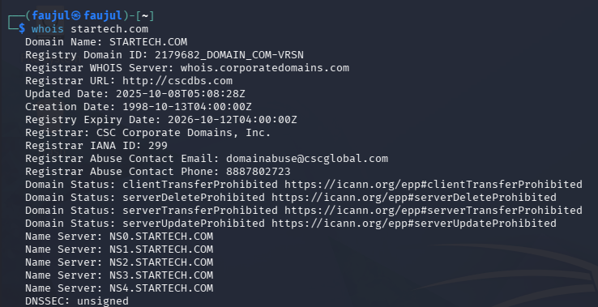

# Lab 01 — WHOIS Reconnaissance


---

## What is WHOIS?

WHOIS is a tool that queries public databases to find registration information about a domain name — things like who registered it, when, and which name servers it uses. It is **passive**, meaning it never directly contacts the target.

---

## Objective

Gather domain registration and DNS information about `startech.com` using the `whois` command.

---

## Command Used

```bash
whois startech.com
```

---

## Output

```
Domain Name: STARTECH.COM
Registry Domain ID: 2179682_DOMAIN_COM-VRSN
Registrar WHOIS Server: whois.corporatedomains.com
Registrar URL: http://cscdbs.com
Updated Date: 2025-10-08T05:08:28Z
Creation Date: 1998-10-13T04:00:00Z
Registry Expiry Date: 2026-10-12T04:00:00Z
Registrar: CSC Corporate Domains, Inc.
Registrar IANA ID: 299
Registrar Abuse Contact Email: domainabuse@cscglobal.com
Registrar Abuse Contact Phone: 8887802723
Domain Status: clientTransferProhibited
Domain Status: serverDeleteProhibited
Domain Status: serverTransferProhibited
Domain Status: serverUpdateProhibited
Name Server: NS0.STARTECH.COM
Name Server: NS1.STARTECH.COM
Name Server: NS2.STARTECH.COM
Name Server: NS3.STARTECH.COM
Name Server: NS4.STARTECH.COM
DNSSEC: unsigned
```

---

## Screenshot



---

## Findings

| Field | Value |
|-------|-------|
| **Registrar** | CSC Corporate Domains, Inc. |
| **Created** | October 13, 1998 |
| **Expires** | October 12, 2026 |
| **Name Servers** | NS0 – NS4.STARTECH.COM |
| **DNSSEC** | Unsigned |

### Domain Status Flags

| Flag | Meaning |
|------|---------|
| `clientTransferProhibited` | Cannot be transferred by the client |
| `serverDeleteProhibited` | Registry blocks deletion |
| `serverTransferProhibited` | Registry blocks transfer |
| `serverUpdateProhibited` | Registry blocks record updates |

All four locks active — this is a well-protected, high-value domain. DNSSEC is not enabled, meaning DNS responses are not cryptographically signed.
