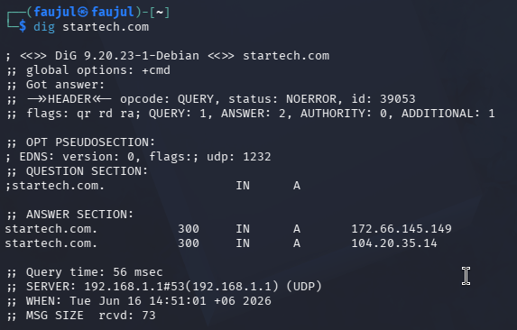

# Lab 02 — DIG (Domain Information Groper)


---

## What is DIG?

DIG (Domain Information Groper) is a command-line tool used to query DNS servers. It returns detailed DNS information about a domain — most importantly the **IP addresses** it resolves to. It is a passive reconnaissance tool.

---

## Objective

Resolve the IP address(es) of `startech.com` using DIG.

---

## Command Used

```bash
dig startech.com
```

---

## Output

```
; <<>> DiG 9.20.23-1-Debian <<>> startech.com
;; global options: +cmd
;; Got answer:
;; ->>HEADER<<- opcode: QUERY, status: NOERROR, id: 39053
;; flags: qr rd ra; QUERY: 1, ANSWER: 2, AUTHORITY: 0, ADDITIONAL: 1

;; OPT PSEUDOSECTION:
; EDNS: version: 0, flags:; udp: 1232

;; QUESTION SECTION:
;startech.com.                  IN      A

;; ANSWER SECTION:
startech.com.           300     IN      A       172.66.145.149
startech.com.           300     IN      A       104.20.35.14

;; Query time: 56 msec
;; SERVER: 192.168.1.1#53(192.168.1.1) (UDP)
;; WHEN: Tue Jun 16 14:51:01 +06 2026
;; MSG SIZE  rcvd: 73
```

---

## Screenshot



---

## Findings

| Field | Value |
|-------|-------|
| **Domain** | startech.com |
| **IP Address 1** | 172.66.145.149 |
| **IP Address 2** | 104.20.35.14 |
| **TTL** | 300 seconds |
| **DNS Server Used** | 192.168.1.1 (local router) |
| **Query Time** | 56 ms |
| **Record Type** | A (IPv4) |

Two IP addresses returned — this indicates `startech.com` uses **load balancing**, distributing traffic across multiple servers. Both IPs belong to **Cloudflare's network**, which also explains the DNSSEC being unsigned found in the WHOIS lab.
