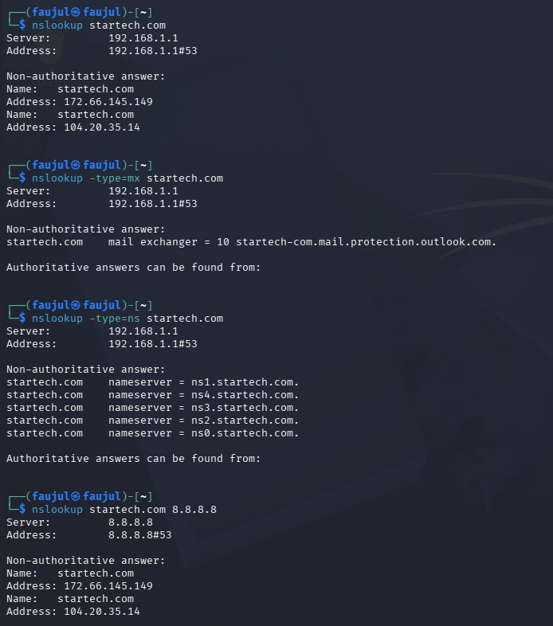
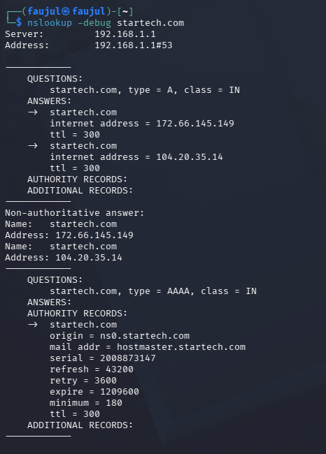

# Lab 03 — NSLOOKUP


---

## What is NSLOOKUP?

NSLOOKUP (Name Server Lookup) is a command-line tool used to query DNS records for a domain. It can retrieve different record types like A (IP address), MX (mail server), and NS (name server). It is a passive reconnaissance tool.

---

## Objective

Query multiple DNS record types for `startech.com` and perform reverse DNS lookup using NSLOOKUP.

---

## Commands Used

| Command | Purpose |
|---------|---------|
| `nslookup startech.com` | Find IP address (A Record) |
| `nslookup 104.20.35.14` | Reverse DNS lookup |
| `nslookup -type=mx startech.com` | Find mail servers (MX Record) |
| `nslookup -type=ns startech.com` | Find name servers (NS Record) |
| `nslookup startech.com 8.8.8.8` | Query using Google's DNS server |
| `nslookup -debug startech.com` | Enable debug mode for detailed output |

---

## Output

**A Record — IP Address Lookup**
```
nslookup startech.com
Server:         192.168.1.1
Address:        192.168.1.1#53

Non-authoritative answer:
Name:   startech.com
Address: 172.66.145.149
Name:   startech.com
Address: 104.20.35.14
```

**Reverse DNS Lookup**
```
nslookup 104.20.35.14
** server can't find 14.35.20.104.in-addr.arpa: NXDOMAIN
```

**MX Record — Mail Server**
```
nslookup -type=mx startech.com
startech.com    mail exchanger = 10 startech-com.mail.protection.outlook.com.
```

**NS Record — Name Servers**
```
nslookup -type=ns startech.com
startech.com    nameserver = ns0.startech.com.
startech.com    nameserver = ns1.startech.com.
startech.com    nameserver = ns2.startech.com.
startech.com    nameserver = ns3.startech.com.
startech.com    nameserver = ns4.startech.com.
```

**Query Using Google DNS (8.8.8.8)**
```
nslookup startech.com 8.8.8.8
Server:         8.8.8.8
Address:        8.8.8.8#53

Non-authoritative answer:
Name:   startech.com
Address: 172.66.145.149
Name:   startech.com
Address: 104.20.35.14
```

**Debug Mode**
```
nslookup -debug startech.com
------------
    QUESTIONS:
        startech.com, type = A, class = IN
    ANSWERS:
    ->  startech.com
        internet address = 172.66.145.149
        ttl = 300
    ->  startech.com
        internet address = 104.20.35.14
        ttl = 300
    AUTHORITY RECORDS:
    ADDITIONAL RECORDS:
------------
Non-authoritative answer:
Name:   startech.com
Address: 172.66.145.149
Name:   startech.com
Address: 104.20.35.14
------------
    QUESTIONS:
        startech.com, type = AAAA, class = IN
    ANSWERS:
    AUTHORITY RECORDS:
    ->  startech.com
        origin = ns0.startech.com
        mail addr = hostmaster.startech.com
        serial = 2008873147
        refresh = 43200
        retry = 3600
        expire = 1209600
        minimum = 180
        ttl = 300
    ADDITIONAL RECORDS:
------------
```

---

## Screenshots




---

## Findings

| Record Type | Value |
|-------------|-------|
| **A Record (IP)** | 172.66.145.149, 104.20.35.14 |
| **MX Record (Mail)** | startech-com.mail.protection.outlook.com |
| **NS Record (Name Servers)** | NS0 – NS4.STARTECH.COM |
| **Reverse DNS** | No PTR record found (NXDOMAIN) |
| **IPv6 (AAAA)** | Not configured |
| **DNS Serial** | 2008873147 |

- `startech.com` uses **Microsoft Outlook / Office 365** for email hosting
- Reverse DNS lookup failed — Cloudflare does not expose PTR records for these IPs
- No IPv6 (AAAA) record exists for this domain
- Both local DNS (192.168.1.1) and Google DNS (8.8.8.8) returned the same IPs, confirming consistent DNS propagation
