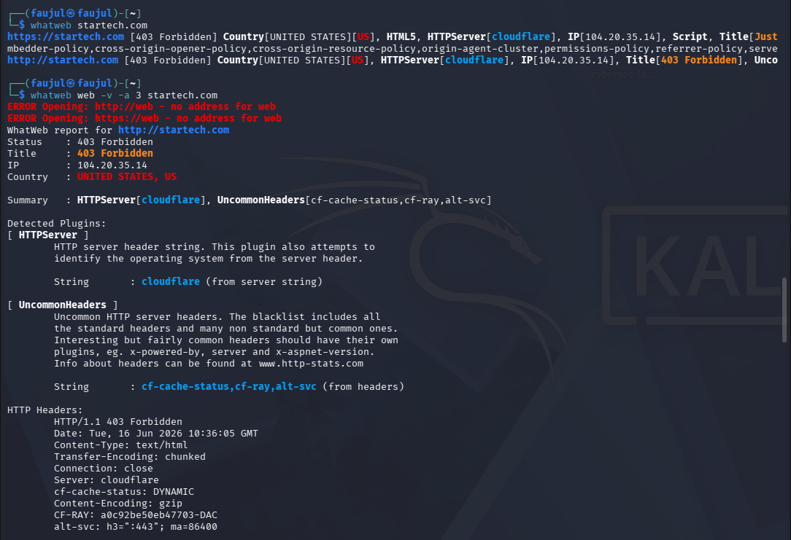

# Lab 04 — WhatWeb


---

## What is WhatWeb?

WhatWeb is a web fingerprinting tool that identifies technologies running on a website. It recognises content management systems (CMS), blogging platforms, analytics packages, JavaScript libraries, web servers, and embedded devices. It has over **1800 plugins**, each detecting something different — including version numbers, email addresses, web frameworks, and more.

---

## Objective

Identify the web technologies and server information running on `startech.com` using WhatWeb.

---

## Commands Used

| Command | Purpose |
|---------|---------|
| `whatweb startech.com` | General web technology check |
| `whatweb -v -a 3 startech.com` | Aggressive scan with verbose output |

---

## Output

**General Check**
```
whatweb startech.com

https://startech.com [403 Forbidden] Country[UNITED STATES][US], HTML5,
HTTPServer[cloudflare], IP[104.20.35.14], Script, Title[Just a moment...],
X-Frame-Options[SAMEORIGIN], X-UA-Compatible[IE=Edge]

http://startech.com [403 Forbidden] Country[UNITED STATES][US],
HTTPServer[cloudflare], IP[104.20.35.14], Title[403 Forbidden]
```

**Aggressive Scan (-v -a 3)**
```
WhatWeb report for https://startech.com
Status    : 403 Forbidden
Title     : Just a moment...
IP        : 104.20.35.14
Country   : UNITED STATES, US

Summary   : HTML5, HTTPServer[cloudflare], Script,
            X-Frame-Options[SAMEORIGIN], X-UA-Compatible[IE=Edge]

Detected Plugins:
[ HTML5 ]       HTML version 5, detected by the doctype declaration
[ HTTPServer ]  String: cloudflare
[ Script ]      Script HTML elements detected
[ X-Frame-Options ] String: SAMEORIGIN
[ X-UA-Compatible ] String: IE=Edge

HTTP Headers:
  Server: cloudflare
  CF-RAY: a0c91873db207706-DAC
  Cf-Mitigated: challenge
  Cross-Origin-Opener-Policy: same-origin
  Cross-Origin-Resource-Policy: same-origin
  X-Content-Type-Options: nosniff
  X-Frame-Options: SAMEORIGIN
  Referrer-Policy: same-origin
  Content-Security-Policy: default-src 'none'; ...
```

---

## Screenshot



---

## Findings

| Field | Value |
|-------|-------|
| **Web Server** | Cloudflare |
| **IP Address** | 104.20.35.14 |
| **Country** | United States |
| **HTTP Status** | 403 Forbidden |
| **HTML Version** | HTML5 |
| **X-Frame-Options** | SAMEORIGIN |
| **CF-Mitigated** | challenge (bot protection active) |

### Notable Observations

- The site returned **403 Forbidden** — Cloudflare is actively blocking automated scanners
- `Cf-Mitigated: challenge` confirms **Cloudflare Bot Protection** is triggered by WhatWeb
- **X-Frame-Options: SAMEORIGIN** prevents the site from being embedded in iframes on other domains — a clickjacking protection
- **Content-Security-Policy** headers are present and strict, limiting what scripts and resources can load
- No CMS, framework, or backend technology was detected — Cloudflare is effectively hiding the origin server
