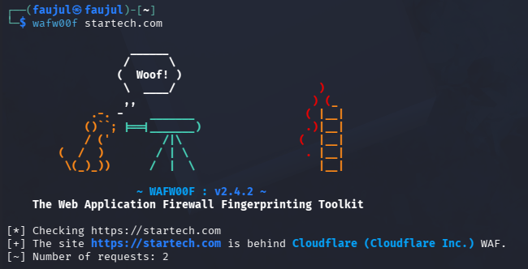

# Lab 05 — WAFW00F


---

## What is WAFW00F?

WAFW00F is a web application firewall (WAF) fingerprinting tool. It detects whether a website is protected by a WAF and identifies which one. This is useful during reconnaissance because knowing a WAF is in place helps a tester understand what kind of protection the target has.

---

## Objective

Detect whether `startech.com` is behind a Web Application Firewall and identify it.

---

## Commands Used

| Command | Purpose |
|---------|---------|
| `wafw00f startech.com` | Detect and identify WAF on target |
| `wafw00f -l` | List all supported firewalls |

---

## Output

```
[*] Checking https://startech.com
[+] The site https://startech.com is behind Cloudflare (Cloudflare Inc.) WAF.
[~] Number of requests: 2
```

---

## Screenshot



---

## Findings

| Field | Value |
|-------|-------|
| **Target** | https://startech.com |
| **WAF Detected** | Cloudflare (Cloudflare Inc.) |
| **Requests Made** | 2 |

- `startech.com` is protected by **Cloudflare WAF** — consistent with what WhatWeb and DIG found earlier
- Only **2 requests** were needed to fingerprint the WAF, making this a very low-noise scan
- This confirms that any active scanning or exploitation attempts against this target would likely be blocked or filtered by Cloudflare
