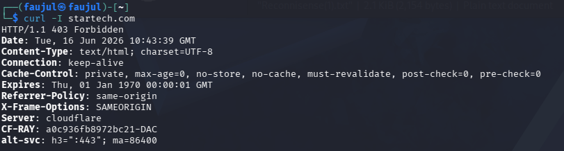

# Lab 06 — cURL


---

## What is cURL?

cURL is a command-line tool for transferring data using various protocols. In reconnaissance, it is used to fetch **HTTP response headers** from a web server — revealing server type, security headers, caching policies, and more — without downloading the full page content.

---

## Objective

Retrieve HTTP response headers from `startech.com` to identify server information and security configurations.

---

## Commands Used

| Command | Purpose |
|---------|---------|
| `curl -I startech.com` | Fetch HTTP headers only (HEAD request) |

---

## Output

```
curl -I startech.com

HTTP/1.1 403 Forbidden
Date: Tue, 16 Jun 2026 10:43:39 GMT
Content-Type: text/html; charset=UTF-8
Connection: keep-alive
Cache-Control: private, max-age=0, no-store, no-cache, must-revalidate, post-check=0, pre-check=0
Expires: Thu, 01 Jan 1970 00:00:01 GMT
Referrer-Policy: same-origin
X-Frame-Options: SAMEORIGIN
Server: cloudflare
CF-RAY: a0c936fb8972bc21-DAC
alt-svc: h3=":443"; ma=86400
```

---

## Screenshot



---

## Findings

| Header | Value |
|--------|-------|
| **HTTP Status** | 403 Forbidden |
| **Server** | Cloudflare |
| **X-Frame-Options** | SAMEORIGIN |
| **Referrer-Policy** | same-origin |
| **Cache-Control** | no-store, no-cache |
| **Expires** | Thu, 01 Jan 1970 (epoch — effectively expired) |
| **CF-RAY** | a0c936fb8972bc21-DAC |
| **alt-svc** | h3=":443" (HTTP/3 supported) |

- Server is **Cloudflare** — origin server is hidden, consistent with previous labs
- **Cache-Control** is set to no caching at all, meaning responses are never stored
- **Expires set to epoch (1970)** is a deliberate trick to force browsers to never cache the page
- **HTTP/3 is supported** via the `alt-svc: h3` header
- **CF-RAY** is a Cloudflare trace ID — useful for identifying which Cloudflare data center handled the request (`DAC` = Dhaka, Bangladesh)
