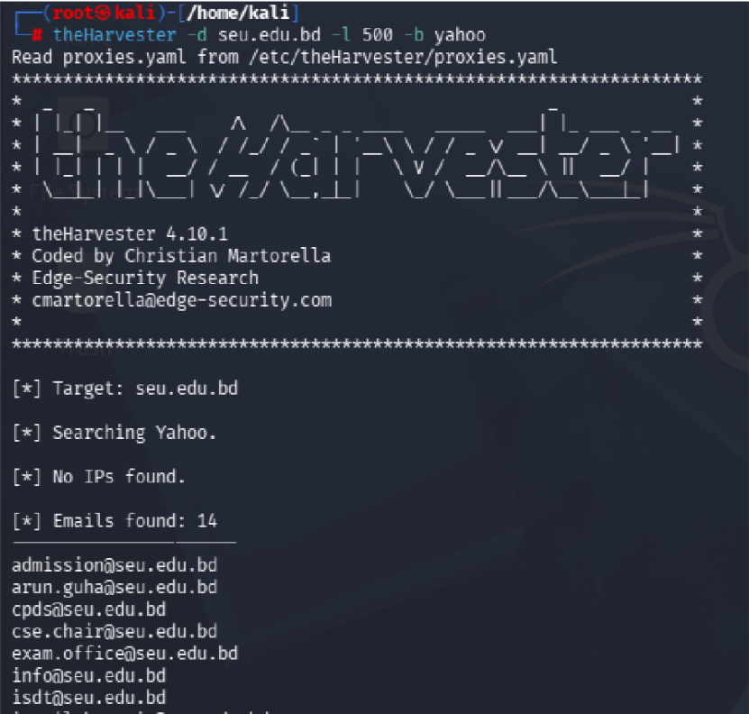
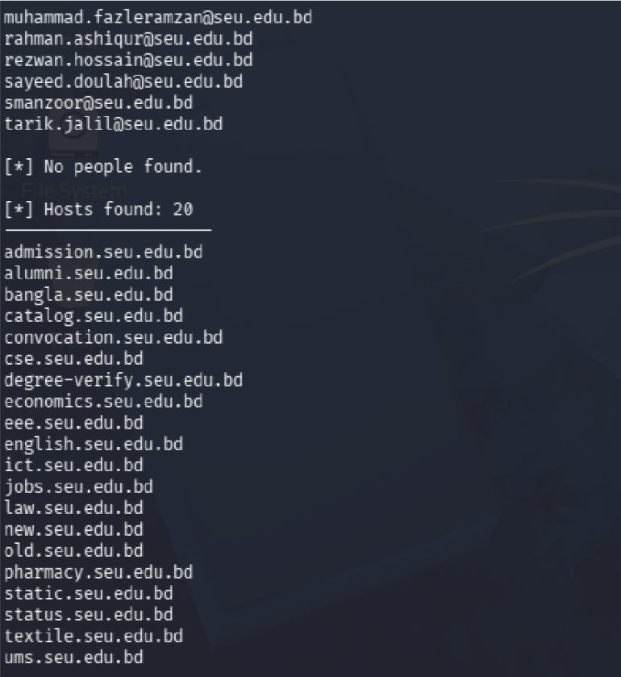

# Lab 07 — theHarvester


---

## What is theHarvester?

theHarvester is an OSINT (Open Source Intelligence) tool used to gather **emails, subdomains, hosts, and IP addresses** about a target domain from public sources like search engines. It is commonly used in the early stages of penetration testing to map out a target's exposed attack surface.

---

## Objective

Harvest email addresses and subdomains associated with `seu.edu.bd` using theHarvester with Yahoo as the data source.

---

## Commands Used

| Command | Purpose |
|---------|---------|
| `theHarvester -d seu.edu.bd -l 500 -b yahoo` | Harvest emails and hosts using Yahoo, limit 500 results |
| `theHarvester -d example.com -b all -f output.html` | Harvest from all sources and save to HTML file |

---

## Output

```
theHarvester -d seu.edu.bd -l 500 -b yahoo

[*] Target: seu.edu.bd
[*] Searching Yahoo.
[*] No IPs found.

[*] Emails found: 14
────────────────────
admission@seu.edu.bd
arun.guha@seu.edu.bd
cpds@seu.edu.bd
cse.chair@seu.edu.bd
exam.office@seu.edu.bd
info@seu.edu.bd
isdt@seu.edu.bd
muhammad.fazleramzan@seu.edu.bd
rahman.ashiqur@seu.edu.bd
rezwan.hossain@seu.edu.bd
sayeed.doulah@seu.edu.bd
smanzoor@seu.edu.bd
tarik.jalil@seu.edu.bd

[*] No people found.

[*] Hosts found: 20
────────────────────
admission.seu.edu.bd
alumni.seu.edu.bd
bangla.seu.edu.bd
catalog.seu.edu.bd
convocation.seu.edu.bd
cse.seu.edu.bd
degree-verify.seu.edu.bd
economics.seu.edu.bd
eee.seu.edu.bd
english.seu.edu.bd
ict.seu.edu.bd
jobs.seu.edu.bd
law.seu.edu.bd
new.seu.edu.bd
old.seu.edu.bd
pharmacy.seu.edu.bd
static.seu.edu.bd
status.seu.edu.bd
textile.seu.edu.bd
ums.seu.edu.bd
```

---

## Screenshots




---

## Findings

| Field | Value |
|-------|-------|
| **Target** | seu.edu.bd |
| **Source** | Yahoo |
| **Emails Found** | 14 |
| **Hosts/Subdomains Found** | 20 |
| **IPs Found** | 0 |

### Emails Harvested
| Email | likely Role |
|-------|------------|
| admission@seu.edu.bd | Admissions department |
| cse.chair@seu.edu.bd | CSE department chair |
| exam.office@seu.edu.bd | Exam office |
| info@seu.edu.bd | General contact |
| arun.guha@seu.edu.bd | Faculty/staff |
| muhammad.fazleramzan@seu.edu.bd | Faculty/staff |
| rahman.ashiqur@seu.edu.bd | Faculty/staff |
| rezwan.hossain@seu.edu.bd | Faculty/staff |
| sayeed.doulah@seu.edu.bd | Faculty/staff |
| smanzoor@seu.edu.bd | Faculty/staff |
| tarik.jalil@seu.edu.bd | Faculty/staff |

### Notable Subdomains
| Subdomain | Likely Purpose |
|-----------|---------------|
| admission.seu.edu.bd | Student admissions portal |
| degree-verify.seu.edu.bd | Certificate verification system |
| ums.seu.edu.bd | University management system |
| jobs.seu.edu.bd | Job/career portal |
| old.seu.edu.bd | Legacy/old website |
| status.seu.edu.bd | Service status page |

- **14 real email addresses** were found from a single public search — this shows how much information is publicly exposed without any active scanning
- Individual faculty names and emails are visible, which could be used in **phishing or social engineering** attacks
- **20 subdomains** discovered, each representing a potential additional attack surface
- `degree-verify` and `ums` subdomains are particularly sensitive as they likely handle student and institutional data
