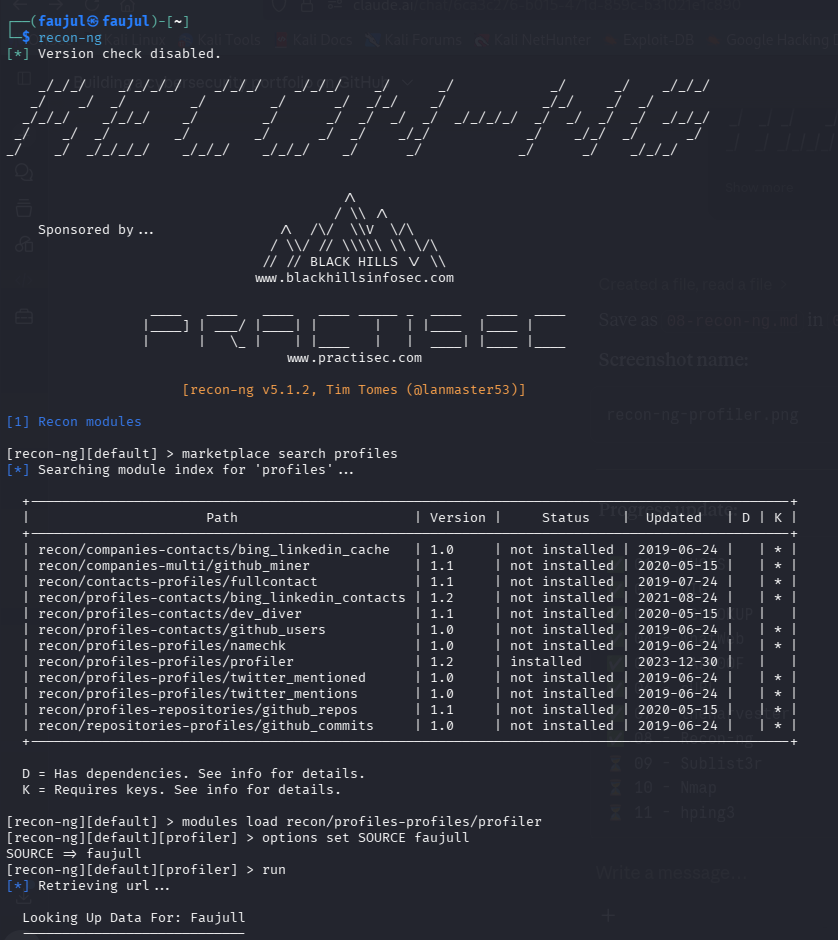

# Lab 08 — Recon-ng


---

## What is Recon-ng?

Recon-ng is a full-featured web reconnaissance framework built in Python. It works similarly to Metasploit but is focused on OSINT gathering. It uses **modules** to collect information such as domain contacts, subdomains, hosts, and social media profiles from public sources.

---

## Objective

Use Recon-ng's `profiler` module to search for online profiles associated with a username across multiple platforms.

---

## Installation

```bash
apt-get install recon-ng
```

---

## Commands Used

```bash
recon-ng                                          # Launch Recon-ng
marketplace search profiles                       # Search for profile-related modules
modules load recon/profiles-profiles/profiler     # Load the profiler module
options set SOURCE faujull                        # Set target username
run                                               # Run the module
show profiles                                     # Display results
```

### Useful Commands Reference

| Command | Purpose |
|---------|---------|
| `workspaces create <name>` | Create a new workspace |
| `workspaces list` | List all workspaces |
| `marketplace search` | Browse all available modules |
| `marketplace install <path>` | Install a module |
| `modules load <path>` | Load a module |
| `options set SOURCE <target>` | Set the target domain or username |
| `run` | Execute the loaded module |
| `show hosts` | Display discovered hosts |
| `show contacts` | Display discovered contacts |
| `db insert domains` | Manually add a domain to the database |
| `db schema` | View all database tables |
| `db delete contacts <range>` | Delete specific rows from a table |

### Most Useful Modules

| Module | Purpose |
|--------|---------|
| `recon/domains-contacts/whois_pocs` | Find domain contacts via WHOIS |
| `recon/domains-hosts/google_site_web` | Find hosts via Google |
| `recon/domains-hosts/hackertarget` | Find all hosts using HackerTarget |
| `recon/domains-hosts/brute_hosts` | Brute-force subdomains |
| `recon/profiles-profiles/profiler` | Find social profiles by username |
| `discovery/info_disclosure/interesting_files` | Find exposed sensitive files |

---

## Output

```
[recon-ng][default] > marketplace search profiles
[recon-ng][default] > modules load recon/profiles-profiles/profiler
[recon-ng][default][profiler] > options set SOURCE faujull
SOURCE => faujull
[recon-ng][default][profiler] > run

  Looking Up Data For: Faujull
  ----------------------------
[*] 11 total (0 new) profiles found.

[recon-ng][default][profiler] > show profiles

  | rowid | username | resource          | url                                          | category |
  |-------|----------|-------------------|----------------------------------------------|----------|
  | 1     | faujull  | AtCoder           | https://atcoder.jp/users/faujull             | coding   |
  | 2     | faujull  | Codeforces        | https://codeforces.com/profile/faujull       | coding   |
  | 3     | faujull  | GitHub (User)     | https://github.com/faujull                   | coding   |
  | 4     | faujull  | Instagram         | https://www.instagram.com/faujull/           | social   |
  | 5     | faujull  | Picsart           | https://picsart.com/u/faujull                | art      |
  | 6     | faujull  | Pinterest         | https://www.pinterest.com/faujull            | social   |
  | 7     | faujull  | Roblox            | https://www.roblox.com/search/users?keyword=faujull | gaming |
  | 8     | faujull  | Scribd            | https://www.scribd.com/search?query=faujull  | hobby    |
  | 9     | faujull  | Substack          | https://substack.com/@faujull                | social   |
  | 10    | faujull  | TikTok            | https://www.tiktok.com/@faujull              | social   |
  | 11    | faujull  | X (Twitter)       | https://x.com/faujull                        | social   |
```

---

## Screenshot



---

## Findings

| Field | Value |
|-------|-------|
| **Target Username** | faujull |
| **Module Used** | recon/profiles-profiles/profiler |
| **Total Profiles Found** | 11 |
| **Categories** | Coding, Social, Art, Gaming, Hobby |

| Category | Platforms |
|----------|-----------|
| **Coding** | AtCoder, Codeforces, GitHub |
| **Social** | Instagram, Pinterest, Substack, TikTok, X |
| **Other** | Picsart, Roblox, Scribd |

- **11 public profiles** were found across different platforms using just a username — this demonstrates how much digital footprint a person leaves online
- This type of search is commonly used in **OSINT investigations** to build a profile of a target individual
- The `profiler` module checks hundreds of platforms automatically without any manual searching
