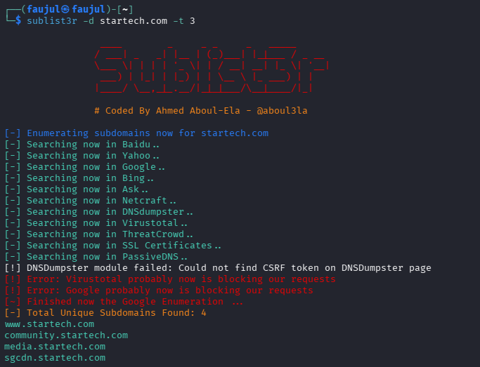

# Lab 09 — Sublist3r


---

## What is Sublist3r?

Sublist3r is a subdomain enumeration tool that searches multiple public sources — including search engines like Google, Bing, Yahoo, and services like VirusTotal and DNSdumpster — to discover subdomains of a target domain. It helps map out the full attack surface of a target.

---

## Objective

Enumerate subdomains of `startech.com` using Sublist3r across multiple search engines simultaneously.

---

## Commands Used

| Command | Purpose |
|---------|---------|
| `sublist3r -d startech.com -t 3` | Enumerate subdomains using 3 threads |
| `sublist3r -h` | Show all available options |
| `sublist3r -d yahoo.com` | Basic subdomain enumeration |
| `sublist3r -v -d yahoo.com -p 80,443` | Verbose mode with port checking |
| `sublist3r -d kali.org -t 3 -e bing` | Enumerate using only Bing with 3 threads |

---

## Output

```
sublist3r -d startech.com -t 3

[-] Enumerating subdomains now for startech.com
[-] Searching now in Baidu..
[-] Searching now in Yahoo..
[-] Searching now in Google..
[-] Searching now in Bing..
[-] Searching now in Ask..
[-] Searching now in Netcraft..
[-] Searching now in DNSdumpster..
[-] Searching now in Virustotal..
[-] Searching now in ThreatCrowd..
[-] Searching now in SSL Certificates..
[-] Searching now in PassiveDNS..

[!] DNSDumpster module failed: Could not find CSRF token on DNSDumpster page
[!] Error: Virustotal probably now is blocking our requests
[!] Error: Google probably now is blocking our requests

[-] Total Unique Subdomains Found: 4
www.startech.com
community.startech.com
media.startech.com
sgcdn.startech.com
```

---

## Screenshot



---

## Findings

| Field | Value |
|-------|-------|
| **Target** | startech.com |
| **Threads Used** | 3 |
| **Sources Searched** | 11 |
| **Subdomains Found** | 4 |

| Subdomain | Likely Purpose |
|-----------|---------------|
| www.startech.com | Main website |
| community.startech.com | Community or forum portal |
| media.startech.com | Media/image hosting |
| sgcdn.startech.com | Content Delivery Network (CDN) |

- Only **4 subdomains** were found — significantly fewer than theHarvester found for `seu.edu.bd`, which shows results vary by target and source
- **Google and VirusTotal blocked** the requests during scanning — a common limitation of automated tools
- **DNSdumpster failed** due to a CSRF token issue, meaning one source was skipped entirely
- `sgcdn.startech.com` suggests they use a **custom CDN** for serving static content
- Despite some sources failing, Sublist3r still pulled results from Baidu, Yahoo, Bing, Netcraft, SSL Certificates, and PassiveDNS
