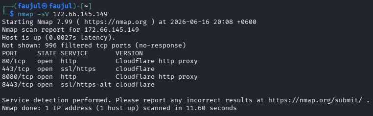
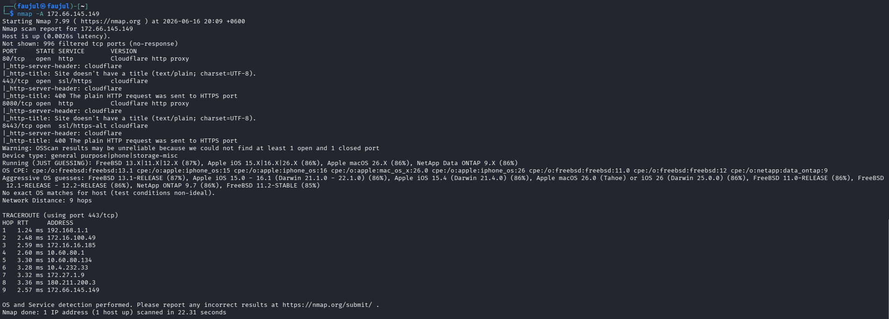
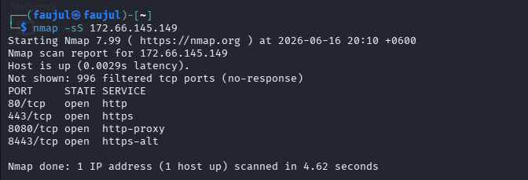
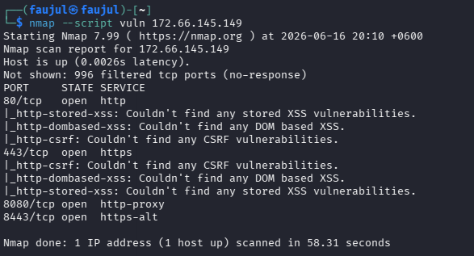

# Lab 10 — Nmap (Network Mapper)


---

## What is Nmap?

Nmap (Network Mapper) is an open-source network scanning tool used to discover hosts, open ports, running services, and operating systems on a network. It is one of the most widely used tools in penetration testing and network auditing. Nmap uses raw packets to probe targets and supports a powerful scripting engine (NSE) for advanced detection and vulnerability checks.

---

## Objective

Scan the IP address `172.66.145.149` (Cloudflare IP of `startech.com`) to identify open ports, running services, OS information, and potential vulnerabilities.

---

## Commands Used

| Command | Purpose |
|---------|---------|
| `nmap -sV 172.66.145.149` | Detect service versions on open ports |
| `nmap -A 172.66.145.149` | Aggressive scan — OS detection, traceroute, scripts |
| `nmap -sS 172.66.145.149` | Stealth SYN scan |
| `nmap --script vuln 172.66.145.149` | Vulnerability scan using NSE scripts |

---

## Output

**Command 1 — Service Version Detection**
```
nmap -sV 172.66.145.149

PORT     STATE SERVICE       VERSION
80/tcp   open  http          Cloudflare http proxy
443/tcp  open  ssl/https     cloudflare
8080/tcp open  http          Cloudflare http proxy
8443/tcp open  ssl/https-alt cloudflare

Nmap done: 1 IP address (1 host up) scanned in 11.60 seconds
```

**Command 2 — Aggressive Scan**
```
nmap -A 172.66.145.149

PORT     STATE SERVICE       VERSION
80/tcp   open  http          Cloudflare http proxy
443/tcp  open  ssl/https     cloudflare
8080/tcp open  http          Cloudflare http proxy
8443/tcp open  ssl/https-alt cloudflare

OS guesses: FreeBSD 13.1-RELEASE (87%), Apple iOS 15.0-16.1 (86%)
No exact OS match found (Cloudflare masking origin)

TRACEROUTE (port 443)
1   1.24 ms  192.168.1.1
2   2.48 ms  172.16.100.49
...
9   2.57 ms  172.66.145.149

Nmap done: 1 IP address (1 host up) scanned in 22.31 seconds
```

**Command 3 — Stealth SYN Scan**
```
nmap -sS 172.66.145.149

PORT     STATE SERVICE
80/tcp   open  http
443/tcp  open  https
8080/tcp open  http-proxy
8443/tcp open  https-alt

Nmap done: 1 IP address (1 host up) scanned in 4.62 seconds
```

**Command 4 — Vulnerability Scan**
```
nmap --script vuln 172.66.145.149

PORT     STATE SERVICE
80/tcp   open  http
|_http-stored-xss: Couldn't find any stored XSS vulnerabilities.
|_http-dombased-xss: Couldn't find any DOM based XSS.
|_http-csrf: Couldn't find any CSRF vulnerabilities.
443/tcp  open  https
|_http-csrf: Couldn't find any CSRF vulnerabilities.
|_http-dombased-xss: Couldn't find any DOM based XSS.
|_http-stored-xss: Couldn't find any stored XSS vulnerabilities.

Nmap done: 1 IP address (1 host up) scanned in 58.31 seconds
```

---

## Screenshots






---

## Findings

| Field | Value |
|-------|-------|
| **Target IP** | 172.66.145.149 |
| **Host Status** | Up |
| **Open Ports** | 80, 443, 8080, 8443 |
| **Service** | Cloudflare HTTP/HTTPS Proxy |
| **OS Detection** | Unreliable — Cloudflare masking origin |
| **Network Hops** | 9 |
| **Vulnerabilities Found** | None (XSS, CSRF, DOM-XSS all clear) |

### Open Ports

| Port | Protocol | Service |
|------|----------|---------|
| 80 | TCP | HTTP |
| 443 | TCP | HTTPS |
| 8080 | TCP | HTTP Proxy |
| 8443 | TCP | HTTPS Alt |

- All 4 open ports belong to **Cloudflare** — the real origin server is completely hidden
- **OS detection was unreliable** because Cloudflare sits in front of the actual server, making fingerprinting inaccurate
- **No vulnerabilities detected** — Cloudflare's WAF and proxy layer blocks any meaningful probing
- The **stealth scan completed in only 4.62 seconds** vs 58 seconds for the vuln scan — showing the speed difference between scan types
- **9 network hops** to reach the target, passing through local router → ISP → Cloudflare edge node
